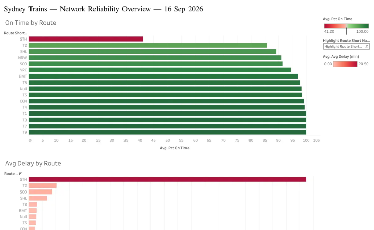
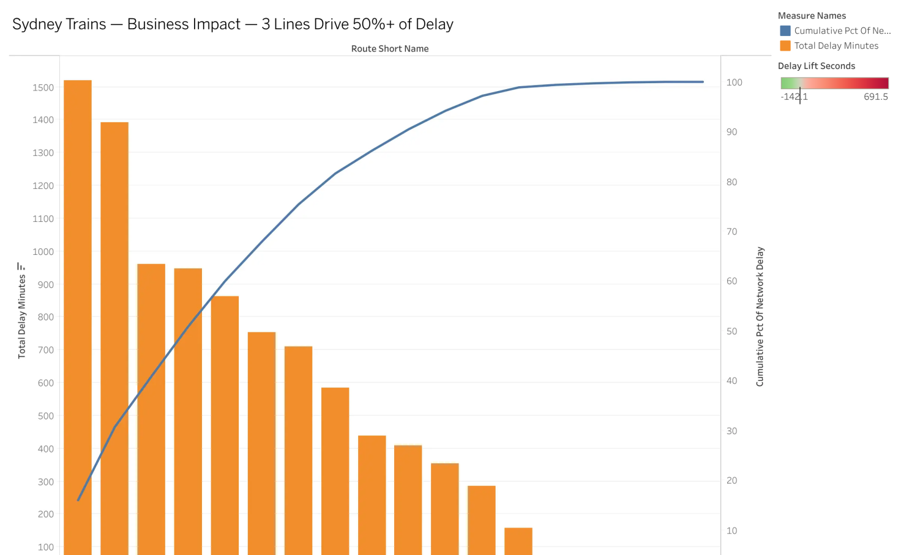

# Sydney Transit Intelligence Platform

An analytics platform that ingests live public transport data from Transport for
NSW (TfNSW) to measure, explain, and surface where Sydney's rail network is
underperforming — and why.

## The problem

TfNSW publishes a live GTFS-Realtime feed, but not a consolidated, historical,
analysis-ready reliability dataset — the realtime feed is a snapshot that only
becomes useful for trend analysis once it's captured over time and reconciled
against the published schedule. That reconciliation (which trip was late, by how
much, and what else was happening at the time) is the actual problem this project
solves.

## Why this project

My other projects — [PAYscope](https://github.com/MSkandula) and E-Commerce
Delivery & Retention Analysis — prove SQL, Python, Power BI/DAX, Tableau, and
data-quality thinking on static, already-collected datasets. This one is built to
demonstrate what those don't: live API ingestion, a lakehouse (Bronze/Silver/Gold),
incremental loading, and pipeline-level data quality checks — the skills that
separate a Data Analyst portfolio from one that also stands up for Junior Data
Engineer / Analytics Engineer roles in the Sydney market. It uses a real, public,
Sydney-specific data source instead of a generic dataset.

## Architecture

```
TfNSW Open Data Hub (GTFS static + GTFS-Realtime v2, trip updates + alerts)
        │
        ▼
Python ingestion  ──►  Databricks Unity Catalog volume (bronze.raw_landing)
        │
        ▼
BRONZE   7 Delta tables — read_files() for static, COPY INTO for realtime
        │                 (COPY INTO tracks already-loaded files itself)
        ▼
dbt Core: staging (8 views) → silver (reconciliation) → gold (8 marts,
          1 incremental fact table, 31 tests) — this is what the scheduled
          pipeline actually runs, replacing the earlier hand-written SQL
        │
        ├──► ml/ — small delay-risk classifier (secondary, honest results)
        └──► CSV extracts ──► Tableau Public (2 published dashboards)

Scheduled every 15 min by a local launchd job. GitHub Actions runs ruff + pytest
on every push, and dbt build against an isolated CI schema on every dbt PR.
```

See [docs/architecture.md](docs/architecture.md) for the full diagram (Mermaid,
renders inline on GitHub) and why a few pieces ended up different from the
original plan. Everything runs on free tooling: Databricks Free Edition
(serverless SQL warehouse + Unity Catalog), GitHub Actions, and Tableau Public.
No paid cloud services anywhere in the stack.

## Tech stack

| Layer | Tool | Why |
|---|---|---|
| Ingestion | Python (`requests`, `gtfs-realtime-bindings`) | Pulls GTFS static + realtime (protobuf) feeds from TfNSW's Open Data Hub |
| Storage / compute | Databricks Free Edition, Delta Lake | Free serverless lakehouse; ACID tables; handles schema drift across weekly static releases |
| Bronze landing | SQL via the Databricks SQL warehouse (`read_files()`, `COPY INTO`) | This project's access token is scoped to SQL only — confirmed by testing, not assumed — so Bronze runs as SQL rather than a PySpark notebook driven by API |
| Silver + Gold transforms | dbt Core (dbt-databricks adapter) | 8 staging models, 1 intermediate (reconciliation) model, 8 marts, 31 tests, 1 incremental fact table — this is what the scheduled pipeline actually runs now, replacing the earlier hand-written SQL |
| BI | Tableau Public | Operational dashboards published from Gold-layer extracts |
| CI/CD | GitHub Actions | ruff + pytest on every push/PR; `dbt build` against an isolated `ci` schema on every PR touching `dbt_transit/` |
| ML (secondary) | scikit-learn | Small delay-risk classifier, deliberately not the focus — [real results reported honestly](ml/README.md), including where it's weak |

Full design rationale, including two things discovered only by actually building
this (the token's SQL-only scope, and TfNSW's realtime feed leaving `start_date`
blank) live in [PROJECT_PLAN.md](PROJECT_PLAN.md).

## What's built and verified so far

Not a plan — real output from the live pipeline:

- **Bronze**: 7 Delta tables in `workspace.bronze` — 137 routes, 1,214 stops, 65,916
  trips, 1,208,729 scheduled stop-times, plus growing realtime trip-stop updates and
  service alerts, accumulating every 15 minutes via the scheduled pipeline
- **Silver + Gold, now dbt-managed**: 21,475 trip-stop observations (and growing)
  across 2 days, reconciled against the static schedule. A clean `dbt build`: **46
  passed, 0 errors**, 31 tests total
- **Three real things dbt's tests caught on real data** (not hypothetical): a
  `REPLACEMENT` schedule_relationship value TfNSW uses for bus-replaces-train
  services that wasn't in the initial accepted-values list; a uniqueness violation
  (1,348 rows) from TfNSW reporting `stop_sequence=0` for every stop on some NSW
  TrainLink intercity trips; and a schema conflict from cutting the scheduled
  pipeline over from hand-written SQL to dbt. Full detail in
  [dbt_transit/README.md](dbt_transit/README.md) and [ROADMAP.md](ROADMAP.md).
- **A real finding**: on 2026-09-16, Sydney Trains' STH line ran 0% on-time with a
  ~39-minute average delay — captured live, not a synthetic example
- **9 passing unit tests** on the GTFS-Realtime protobuf decode logic (trip updates
  + service alerts), plus 31 dbt tests on the transformed data
- **Live dashboards on Tableau Public**:
  - [Network Reliability Overview](https://public.tableau.com/app/profile/mahesh.sai.kandula7753/viz/SydneyTrains-NetworkReliability/NetworkReliabilityOverview) — on-time % and average delay by route, sorted worst to best
  - [Business Impact](https://public.tableau.com/app/profile/mahesh.sai.kandula7753/viz/SydneyTrains-NetworkReliability/BusinessImpact) — the Pareto (delay concentration) and alert-delay-impact findings below, visualized



See [ROADMAP.md](ROADMAP.md) for the full, currently-accurate status per phase.

## Business impact

The point of this platform isn't just "here's a dashboard" — it's answering the
question a network performance team would actually ask: **where should limited
operational attention go first?** `gold.mart_line_delay_concentration` answers that
directly, using the same concentration framing as the "top 10% of sellers drive
67.6% of revenue" finding in my E-Commerce project:

> **3 of Sydney Trains' 16 lines (STH, T4, SCO) are responsible for 50.5% of all
> network delay-minutes captured so far. 6 lines account for 79.0%.**
> (as of 2026-09-17, across 7,399 trip-stop observations spanning 2 days —
> this number updates as the scheduled pipeline accumulates more history)

That's a concrete, actionable answer — fix or investigate those lines first, not
spread effort evenly across 16 — and it's recomputed automatically every time the
pipeline runs, so it gets more statistically reliable as more history accumulates
(see [scripts/run_pipeline.sh](scripts/run_pipeline.sh), which polls TfNSW every 15
minutes to build that history up over time).



**Second finding — do disruption alerts actually matter, or is impact overstated?**
`gold.mart_alert_delay_impact` (from the new `gtfs_service_alerts` feed, joined
against actual observed delay during each alert's active window) answers this with
real correlation, not assumption:

> **The "Buses replace trains between Leppington and Fairfield" maintenance alert
> correlates with an 11.5-minute average delay increase on route IWL_1c while
> active, versus that route's own baseline.**

That's the difference between "we posted a disruption notice" and "the disruption
notice's operational impact was actually this large" — the kind of answer that
turns a dashboard into an evaluation of communication effectiveness, not just a
delay tracker.

## Repository structure

```
ingestion/          Python: TfNSW ingestion, Databricks volume upload, Bronze/
                     Silver/Gold SQL builders, Tableau extract export
scripts/            run_pipeline.sh — the scheduled ingestion entry point
notebooks/           Optional PySpark path for working directly in the Databricks
                     UI (unexecuted — Phase 1 runs entirely via ingestion/)
dbt_transit/         dbt project — live, runs Silver + Gold on every scheduled tick
ml/                  Small, secondary delay-risk classifier — real results, reported honestly
tableau/extracts/    Gold-layer CSVs, ready for Tableau Public
tests/               pytest unit tests
docs/architecture.md  Full architecture diagram (Mermaid) and why it changed from the plan
docs/data_model.md   Star schema reference — grain, keys, columns
docs/kpi_definitions.md  Precise definition of every KPI used in the dashboards
docs/scheduled_ingestion.md  How the local launchd job works, and its real limits
.github/workflows/   CI/CD — ruff + pytest, and dbt build/test on an isolated CI schema
PROJECT_PLAN.md      Full design doc: business case → interview prep
ROADMAP.md           Phased build plan and live status
PREREQUISITES.md     Accounts/tools needed to run this yourself
```

## Running this yourself

See [PREREQUISITES.md](PREREQUISITES.md) for the accounts needed (TfNSW API key,
Databricks Free Edition), then:

```bash
python -m venv .venv && source .venv/bin/activate
pip install -r requirements.txt
pip install dbt-core dbt-databricks   # or: pip install -r dbt_transit/requirements.txt
cp .env.example .env   # fill in your own keys — never commit this file
cp dbt_transit/profiles.yml.example ~/.dbt/profiles.yml   # fill in your username

python ingestion/gtfs_static_ingest.py
python ingestion/gtfs_rt_ingest.py
python ingestion/gtfs_alerts_ingest.py
python ingestion/land_bronze.py

cd dbt_transit && set -a && source ../.env && set +a
dbt deps && dbt build
cd ..

python ingestion/export_gold_extracts.py
```

Or just run [scripts/run_pipeline.sh](scripts/run_pipeline.sh), which does the
realtime/dbt/export steps above in order — that's exactly what the scheduled job
runs (see [docs/scheduled_ingestion.md](docs/scheduled_ingestion.md)).
