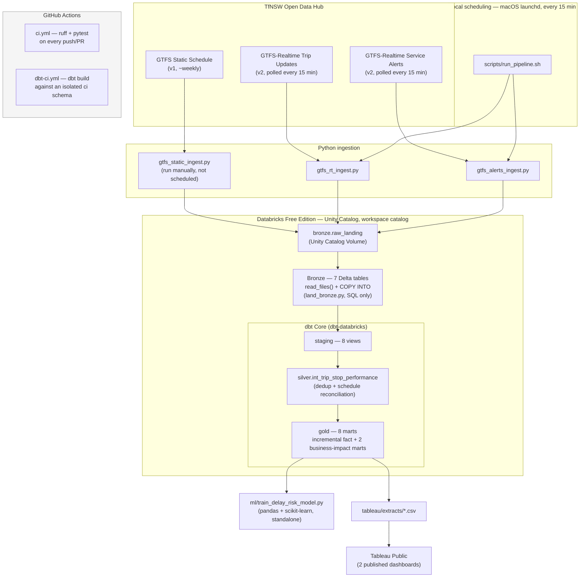

# Architecture

This reflects what's actually built and running, not the original aspiration —
see [PROJECT_PLAN.md](../PROJECT_PLAN.md) for how a few pieces of this changed
along the way (and why), and [ROADMAP.md](../ROADMAP.md) for current status.

## Why this shape, not the original plan

A few things changed from the initial design, all for confirmed reasons (verified
by testing, not assumed) rather than convenience — full detail in PROJECT_PLAN.md
and ROADMAP.md, summarized here:

- **Bronze and Silver/Gold both run as SQL/dbt, not PySpark notebooks.** This
  project's Databricks personal access token is scoped to `sql` only — Jobs,
  Workspace, Files, and Unity Catalog admin APIs all reject it. Confirmed by
  testing each directly.
- **Scheduling is a local `launchd` job, not Databricks Workflows.** Same
  token-scope reason — Workflows needs the Jobs API. `launchd` only runs while
  the Mac is awake, which is a real, stated limitation, not hidden.
- **`dbt build` replaced hand-written SQL for Silver/Gold once dbt_transit/ was
  built** (Phase 3) — both wrote to the same schemas, so only one could run
  against them at a time. The hand-written scripts stay in the repo as the
  Phase 1 reference.
- **The ML model and Bronze landing both run as plain Python/SQL, not PySpark**
  — same token-scope reason, and the data volume (tens of thousands of rows) is
  comfortably small enough locally for that to be the right call anyway.
